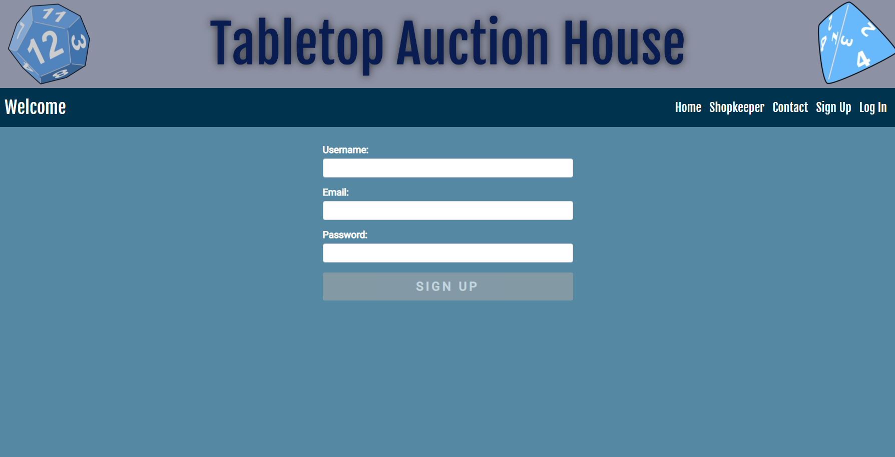

# Tabletop Auction House - React Edition

## Description

*Our goal is to create an auction house interface for roleplaying game masters and players to buy, sell, and trade in-game items for fun and profit.*

Tabletop Auction House provides a marketplace for gamers and game masters to create and exchange in-game equipment, both reducing the creative pressure on the game master and establishing a unique channel by which games might grow and evolve.

Sometimes you don’t want to have to think about the ‘simple’ things when it comes to world-building. Our marketplace takes some of that pressure off while also creating a way to advance the story to whatever depth is desired by the team.

As a game master, you can:

* Display ordinary items for players to purchase
* Introduce items that affect the narrative and move the party in new ways through their environment
* Keep track of your players' items much easier

As a gamer, you can:

* See gear standards for your game
* Grab cool items for your character
* Purchase and track your items in a paper-free format

Visit the Tabletop Auction House today for your roleplaying marketplace needs.

Tabletop Auction House uses JavaScript, React.js, Node.js, Express.js, MongoDB, Mongoose ODM, GraphQL, JSON Web Tokens, Apollo GraphQL, Faker.js, CSS-in-JS, React-Bootstrap, and Heroku with installable PWA functionality. More technologies that we would like to add in the future include Cloudinary and RPG-Awesome.

## Table of Contents

* [Description](#description)
* [Installation](#installation)
* [Usage](#usage)
* [Wireframe](#wireframe)
* [Credits](#credits)
* [License](#license)

## Installation

To install the application's dependencies, type the following:
```md
npm install
```
Host the application on MongoDB.

To run the application locally, type the following:
```md
npm run develop
```

## Usage



A user can use the sign-up page to create their account. They will be directed to the shop page afterward.


The shop page displays all of the products. The user can click on the Add Item page, Shopkeeper, Contact, a product's name, or they can choose to log out.


The user can add an item by entering the Item Name, Price, Quantity, and Category and clicking Add Item.


The user can also view an item and see the Item Name, Price, Quantity, and Category. They can edit or delete the item on this page, if they wish.


The user can generate random shopkeepers with different traits.

Navigate to [Tabletop Auction House 2.0](https://tabletop-auction-house-2.herokuapp.com/) and view the web page.

## Wireframe

A wireframe showing the page's design.

[Tabletop Auction House's Wireframe](https://docs.google.com/presentation/d/1ZrrW8pyQqQYYu9Z_OkplCIA2Lk5IExDmOEinp_IujaI/)

## Credits

Tabletop Auction House is a coding project done by the Prosperous Merchants. The team members are:
* Elise Daly - [https://github.com/elisesamanthadaly/](https://github.com/elisesamanthadaly/)
* Soma Mäkelä - [https://github.com/smakela13/](https://github.com/smakela13/)
* Thomas Musler - [https://github.com/lordgeer/](https://github.com/lordgeer/)
* Nelson Johns - [https://github.com/ntjohns1/](https://github.com/ntjohns1/)

## License

This website has No License, which means it is under exclusive copyright. No one can copy, distribute, or modify this website without permission.
